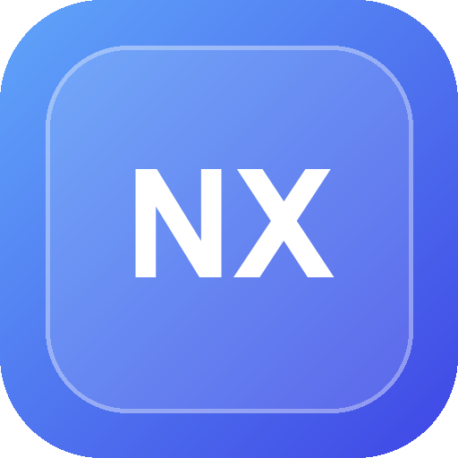

# OpenNexus — AI Workspace for Teams

<p align="center">
  
</p>

<p align="center"><strong>Bring WPS multidimensional spreadsheets, knowledge, reminders, messaging, dashboards, and MCP together.</strong></p>

<p align="center">
  <a href="README.md">简体中文</a> · English
</p>

<p align="center"><a href="https://github.com/bjmengxf98/OpenNexus">github.com/bjmengxf98/OpenNexus</a></p>

OpenNexus is an open-source, self-hosted AI workspace designed for departments and small teams. It turns structured data in WPS multidimensional spreadsheets into business-aware conversations, automations, dashboards, reminders, and tools that other AI clients can call through MCP.

OpenNexus is not merely a chatbot for spreadsheets. Its goal is to provide a practical AI operating layer for day-to-day team work.

## Highlights

- Query and maintain WPS multidimensional spreadsheets using natural language
- Daily progress, task, project, and department-level dashboards
- Business-aware reminders with retryable delivery through WeCom, WPS messaging, and an experimental personal-WeChat bridge
- File upload, image understanding, document generation, and RAG-based knowledge retrieval
- Topic-based conversations, users, roles, audit records, and feedback management
- A full MCP server for WorkBuddy and other compatible clients, with least-privilege tokens, code-enforced approval for high-risk actions, and audit trails
- Responsive desktop/mobile UI, PWA installation, and light/dark/system themes

## Architecture

- Backend: Python 3.12, FastAPI, SQLite
- Frontend: native HTML, CSS, and JavaScript
- Integrations: WPS OpenAPI and OpenAI-compatible model APIs
- Optional personal-WeChat bridge: Node.js, adapted from a third-party MIT-licensed project

## Quick Start

### 1. Create an environment

Python 3.12 or later is required. Node.js 18 or later is only required for the optional personal-WeChat bridge.

```bash
python -m venv .venv
```

Windows:

```powershell
.venv\Scripts\python -m pip install -r requirements.txt
Copy-Item .env.example .env
```

Linux/macOS:

```bash
.venv/bin/python -m pip install -r requirements.txt
cp .env.example .env
```

### 2. Configure

Edit `.env` and set at least:

- `SESSION_SECRET`: a long random value
- `INITIAL_ADMIN_EMAIL` and `INITIAL_ADMIN_PASSWORD`: used only when the first administrator is created
- `WPS_APP_ID`, `WPS_APP_SECRET`, and the correct callback URL when WPS integration is enabled
- `COMPLIANCE_MEMBER_NAMES` and `COMPLIANCE_MEMBER_IDS` in the private `.env` when a global compliance-notification allowlist is required

Set `SESSION_COOKIE_SECURE=1` when serving the production instance over HTTPS.

### 3. Run

Windows:

```powershell
.venv\Scripts\python app.py
```

Linux/macOS:

```bash
.venv/bin/python app.py
```

Open `http://127.0.0.1:8000`. If the database contains no users, OpenNexus creates the initial administrator from the environment variables above.

## Optional Personal-WeChat Bridge

```bash
cd wechat-claude-code-main
npm ci
npm run build
```

This directory is an adapted version of a third-party MIT-licensed project. The original license is retained. This integration is experimental, is not affiliated with or endorsed by Tencent or WeChat, and should only be enabled after evaluating platform, privacy, and account risks. See [THIRD_PARTY_NOTICES.md](THIRD_PARTY_NOTICES.md).

## Tests

```bash
python -m pip install -r requirements-dev.txt
python -m pytest test_reminders.py test_dashboard.py test_app_new.py test_pwa.py test_admin_settings_new.py -q
```

## Security and Data Boundaries

Runtime databases, `.env`, logs, uploads, local credentials, QR codes, and internal screenshots are intentionally excluded from source control. Never submit production data or secrets. See [SECURITY_EN.md](SECURITY_EN.md) before deploying or reporting a vulnerability.

For detailed product usage, see the [English User Guide](docs/User-Guide-EN.md).

## Contributing

Issues, ideas, documentation improvements, and pull requests are welcome. Read [CONTRIBUTING_EN.md](CONTRIBUTING_EN.md) first. All fixtures, screenshots, and examples must be safe for public distribution.

## License

OpenNexus-owned code is licensed under the [Apache License 2.0](LICENSE). Third-party components remain governed by their respective licenses; see [NOTICE](NOTICE) and [THIRD_PARTY_NOTICES.md](THIRD_PARTY_NOTICES.md).

Copyright 2026 Meng Xianfeng (孟宪锋).
